# R Shop - Modern E-Commerce Android App

A professional, high-performance e-commerce application built with **Kotlin** and **Jetpack Compose**. This project follows **Clean Architecture** principles and implements an **MVI (Model-View-Intent)** style architecture for a scalable and maintainable codebase.

## 🚀 Overview
**R Shop** provides a seamless shopping experience with advanced features like product discovery via Barcode/QR scanning, integrated Razorpay payments, and precise location-based services.

## 📸 App Walkthrough

### 📽️ App Flow (Light & Dark Theme)
| Light Mode Flow | Dark Mode Flow |
|:---:|:---:|
| 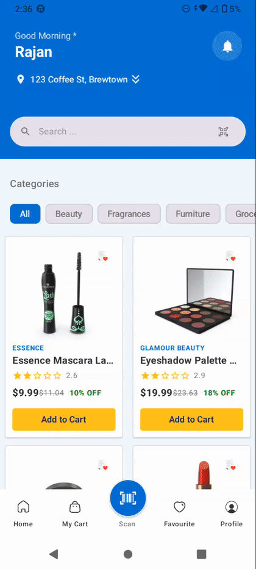 | 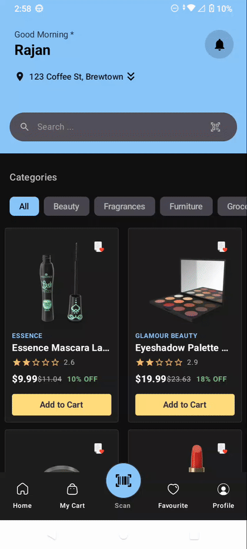 |


### 🏠 Core Screens
|             Home Screen              | My Cart | Wishlist | User Profile |
|:------------------------------------:|:---:|:---:|:---:|
| 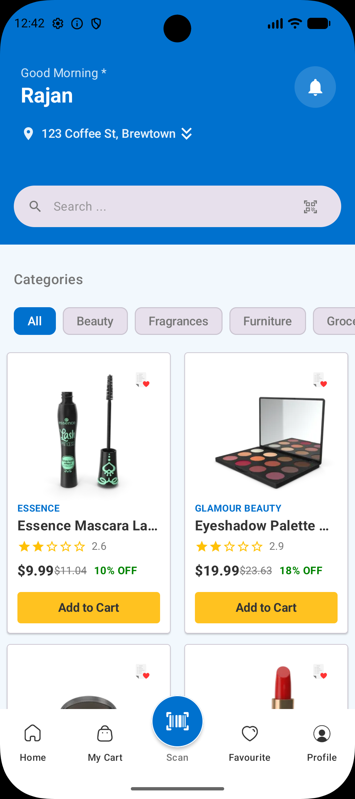 | 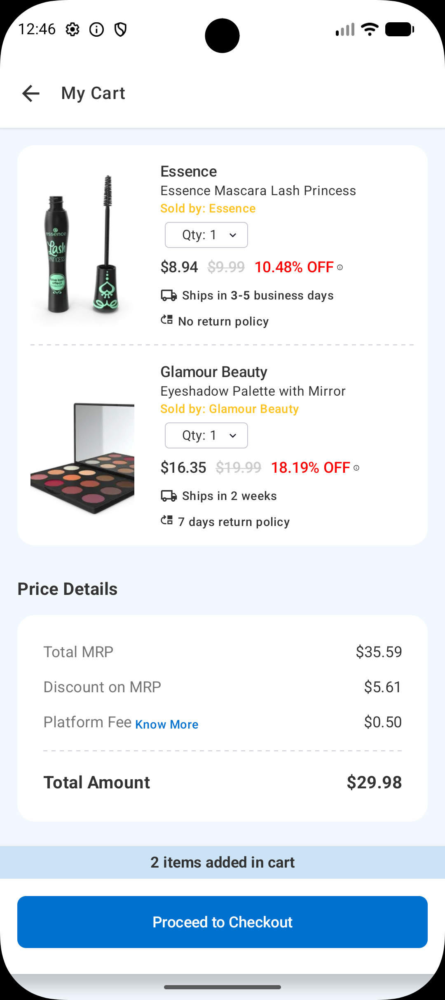 | 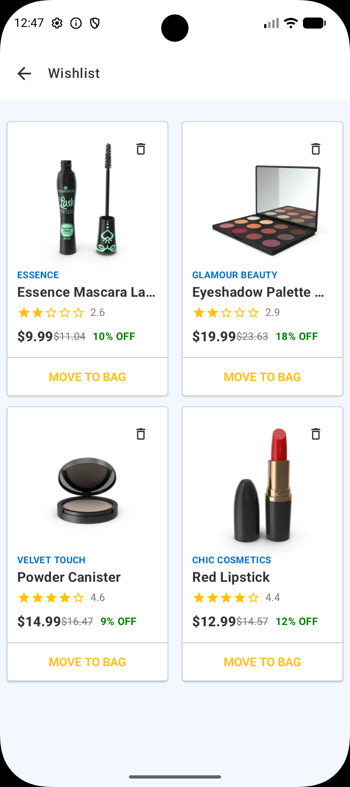 | 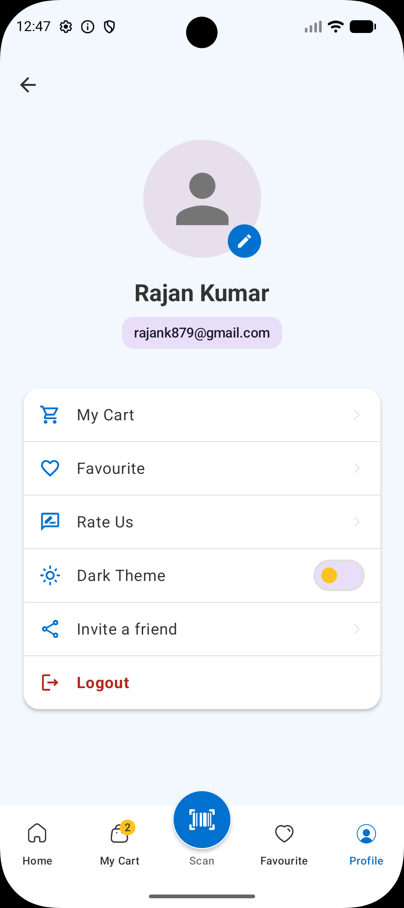 |

### 🔍 Discovery & Search
| Barcode Scanner | Search Suggestions | Search Results (PLP) | Product Details (PDP) |
|:---:|:---:|:---:|:---:|
| 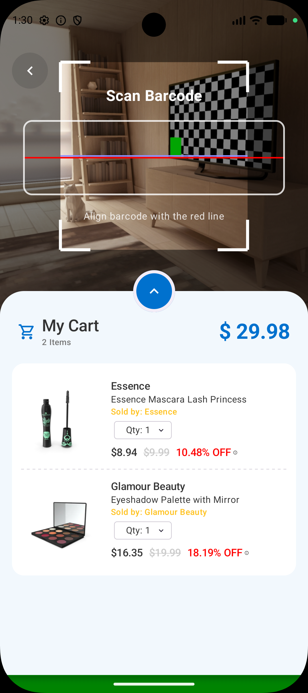 | 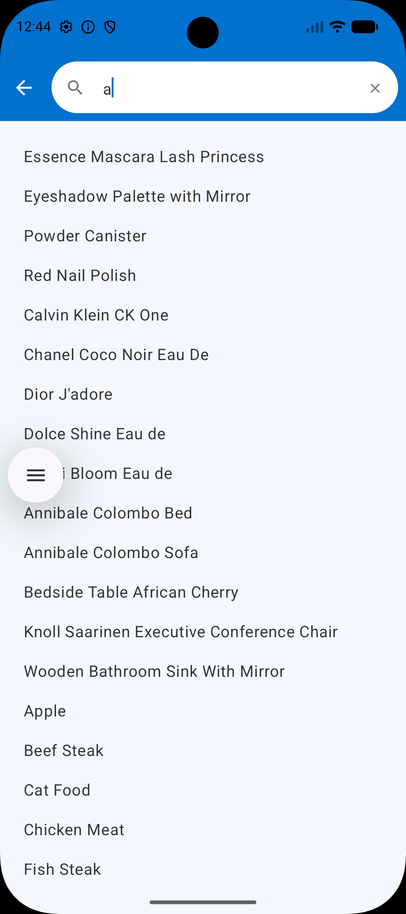 | 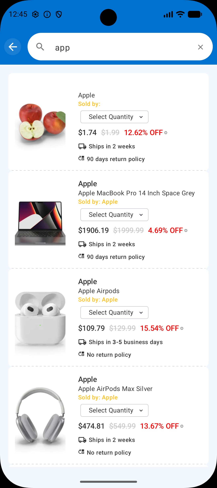 | 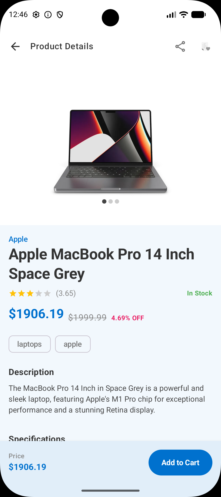 |

### 💳 Checkout Flow
| Step 1: Review Cart |   Step 2: Location Picker    | Step 3: Add Address |           Step 4: Payment Options           |
|:---:|:----------------------------:|:---:|:-------------------------------------------:|
|  | 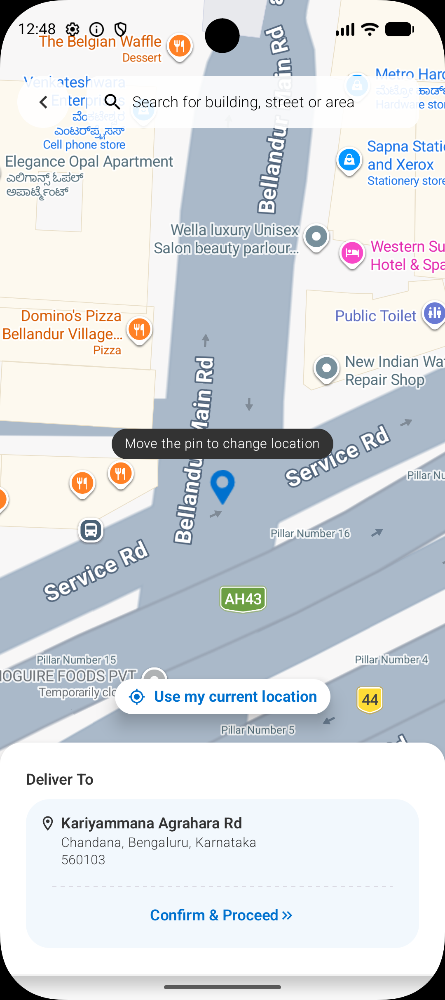 | 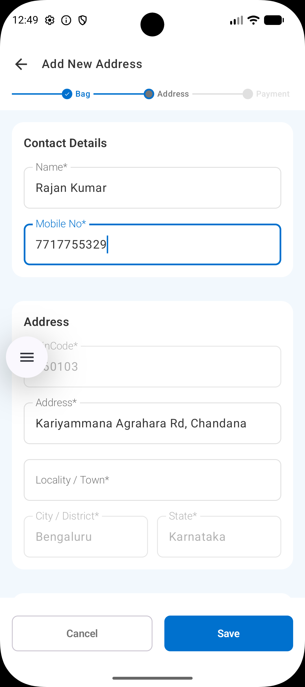 | 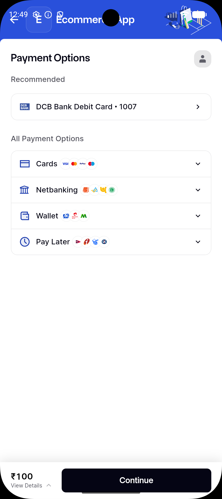 |

| Step 5: Card Entry | Step 6: Process / OTP | Step 7: Success |
|:---:|:---:|:---:|
| 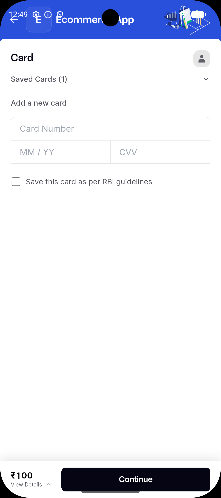 | 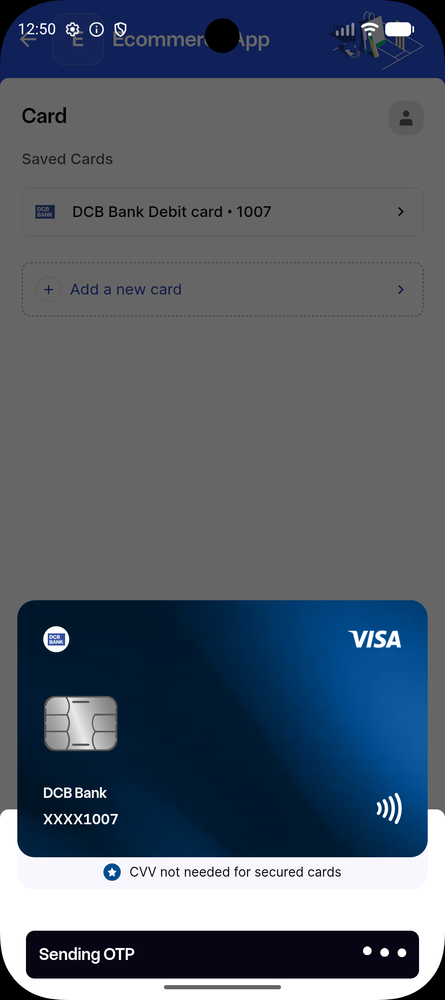 | 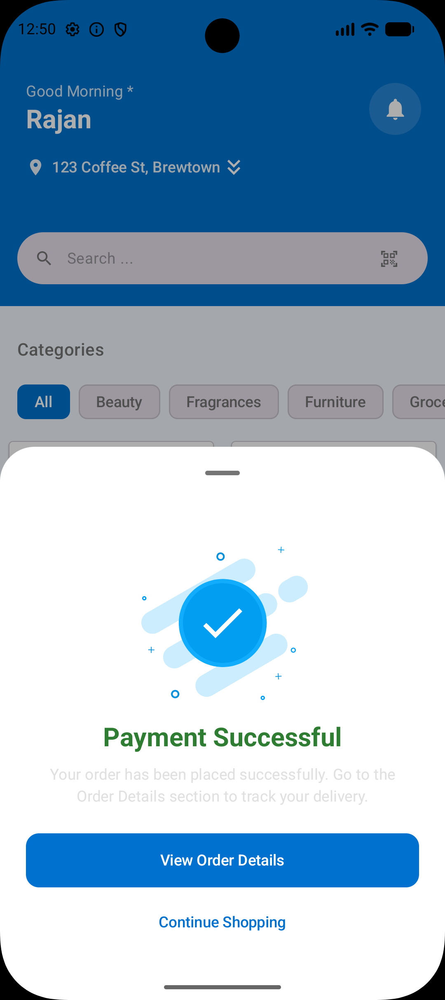 |

## 🏗️ Architecture
The project is built using **Clean Architecture** to ensure separation of concerns and ease of testing.

- **Presentation Layer (MVVM + MVI):** Uses ViewModels to manage UI state, emitting single states and handling side-effects through SharedFlow/Channels.
- **Domain Layer:** Pure Kotlin layer containing business logic, entities, and use cases.
- **Data Layer:** Handles data synchronization between Remote (Retrofit) and Local (Room DB) sources.

## 🛠️ Tech Stack & Libraries
- **Language:** [Kotlin](https://kotlinlang.org/)
- **UI Framework:** [Jetpack Compose](https://developer.android.com/compose) with Material 3
- **Asynchronous Programming:** [Coroutines](https://kotlinlang.org/docs/coroutines-overview.html) & [Flow](https://kotlinlang.org/docs/flow.html) for reactive data streams.
- **Dependency Injection:** [Hilt](https://developer.android.com/training/dependency-injection/hilt-android)
- **Data Loading:** [Paging 3](https://developer.android.com/topic/libraries/architecture/paging/v3-p3) for efficient list rendering and infinite scrolling.
- **Networking:** [Retrofit](https://square.github.io/retrofit/) & [OkHttp](https://square.github.io/okhttp/)
- **Local Persistence:** [Room Database](https://developer.android.com/training/data-storage/room) for Cart and Favourite management.
- **Navigation:** [Navigation Compose](https://developer.android.com/jetpack/compose/navigation) (Type-safe routing)
- **Animations:** [Lottie](https://airbnb.io/lottie/#/android) for interactive and engaging user feedback.
- **Maps & Location:** [Google Maps SDK](https://developers.google.com/maps/documentation/android-sdk/overview) & [Places API](https://developers.google.com/maps/documentation/places/android-sdk/overview)
- **Payments:** [Razorpay Android SDK](https://razorpay.com/docs/payments/payment-gateway/android-integration/standard/)
- **Scanning:** [ML Kit](https://developers.google.com/ml-kit/vision/barcode-scanning/android) for Barcode and QR code product lookup.
- **Image Loading:** [Coil](https://coil-kt.github.io/coil/)

## ✨ Key Features
- **Smart Product Search:** Search by keywords or instantly by scanning a **Barcode or QR code**.
- **Interactive Location Picker:** Integrated **Google Maps** to select and search delivery addresses via **Places API**.
- **Modern UI/UX:** Built entirely with **Jetpack Compose**, featuring a clean, responsive design.
- **Dynamic Theming:** Native support for **Dark and Light modes** that respects system settings.
- **Shopping Cart & Wishlist:** Fully functional persistence using Room DB.
- **Secure Checkout:** Professional payment integration with **Razorpay**.
- **Lottie Animations:** High-quality vector animations for success, loading, and empty states.

## 📂 Project Structure
```text
com.rajan.ecommerce
├── data           # Repository implementations, API services, Room DAOs, and Mappers
├── domain         # Business entities, Repository interfaces, and Use Cases
├── presentation   # UI Layer
│   ├── feature    # Modules (Home, Search, PDP, Cart, Address, etc.)
│   ├── ui_components # Reusable Compose widgets
│   ├── theme      # Material 3 Theme definition
│   └── navigation # NavHost and Route definitions
└── di             # Hilt Dependency Injection Modules
```

## ⚙️ Setup
1. Clone the repository.
2. Ensure you have the `screenshots` folder with appropriately named images.
3. Add your `google-services.json` to the `app/` folder.
4. Configure your API keys in `local.properties`:
   - `GOOGLE_MAPS_KEY=your_key_here`
   - `RAZORPAY_KEY=your_key_here`
5. Sync Gradle and build the project.

---
Developed by **Rajan Kumar**
